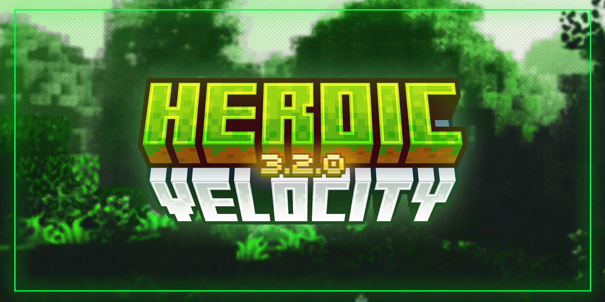
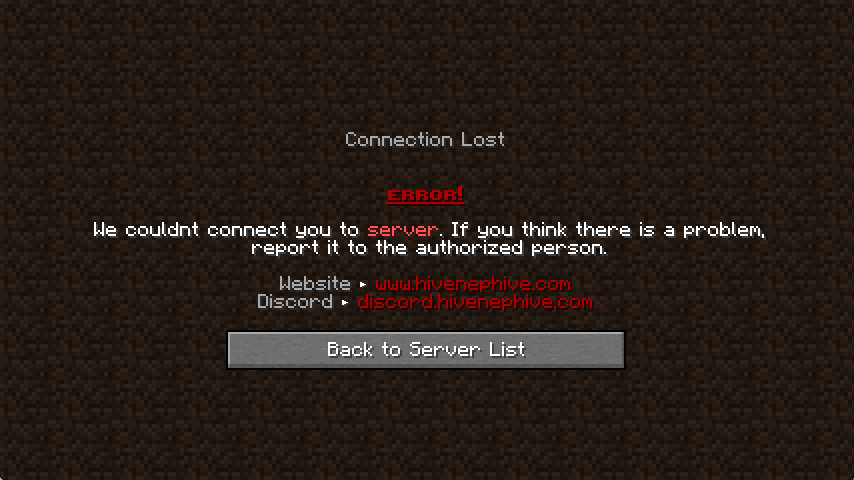

# 🔮 Heroic Velocity (3.2.0)

<figure><figcaption></figcaption></figure>

## Overview

***

Thank you for your purchase. Here, you can find details about your setup.

### Features

***

* :four\_leaf\_clover:**Vanilla Friendly:** Everything in the setup is designed in a vanilla and understandable way.
* :busts\_in\_silhouette: **Friend System:** It's a feature that enables players to connect in-game and participate in multiplayer gameplay.
* :chart\_with\_upwards\_trend:**Optimized:** It has been optimized and strengthened to ensure optimal performance.
* :electric\_plug:**Easy to use:** You can refer to the documentation to learn how to efficiently edit and modify your Minecraft server. This will improve its usability, enhancing your overall user experience.
* :hourglass\_flowing\_sand:**Longevity:** Bug fixes, new features, and fast support are available to you.


**Information:** Don't forget to review additional pages for information on your product and open a support ticket on Discord if you require assistance.


### Screenshots

***

<figure><figcaption>
<strong>Message shown when the server is down.</strong>
</figcaption></figure>
